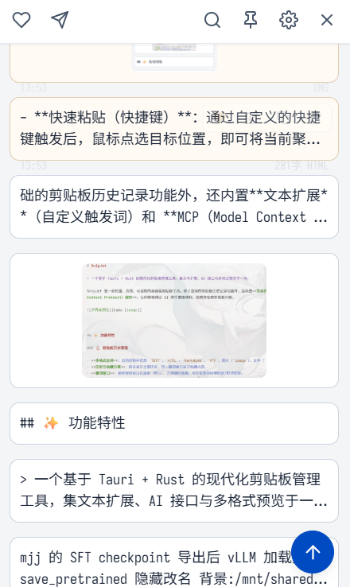
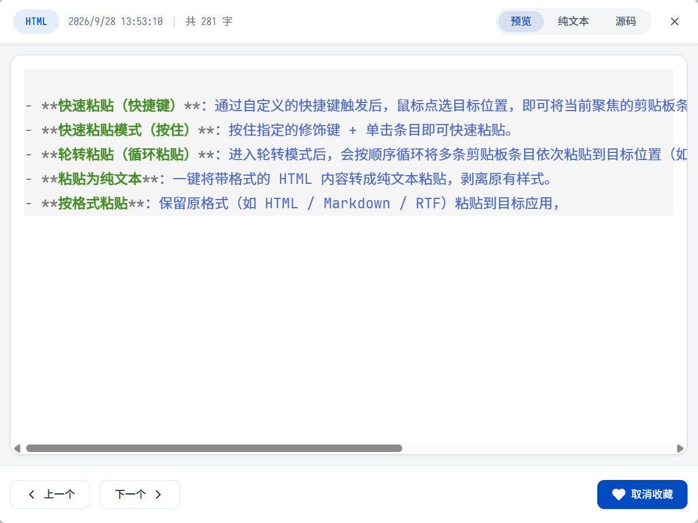
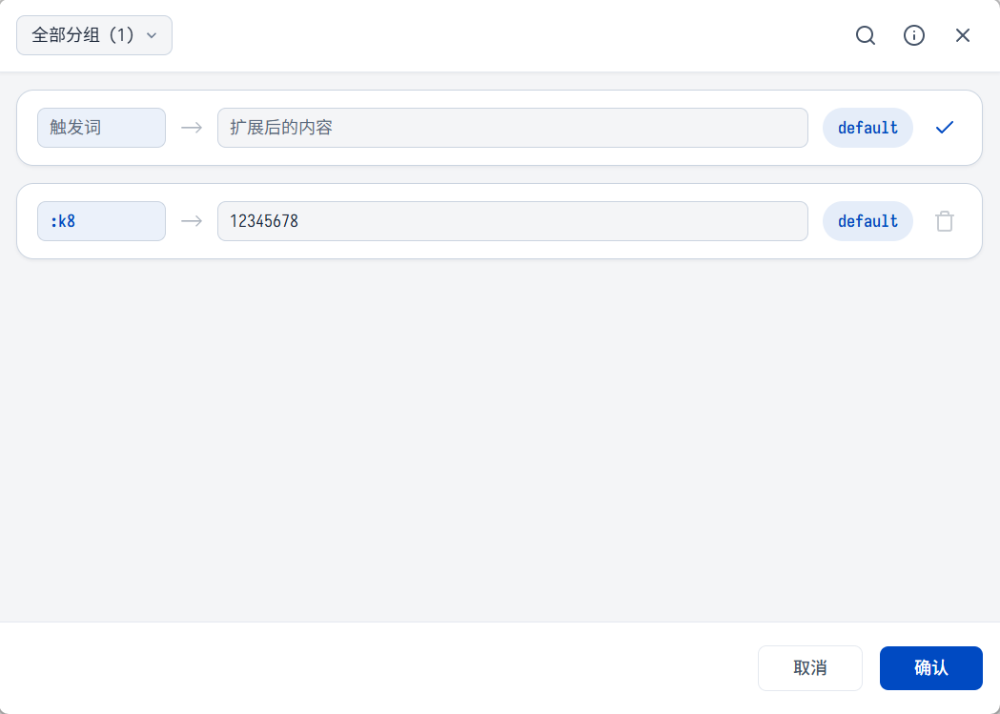

# SnipJet

> 一个基于 Tauri + Rust 的现代化剪贴板管理工具，集文本扩展、AI 接口与多格式预览于一体。

SnipJet 是一款轻量、高效、可定制的桌面端剪贴板工具。除了基础的剪贴板历史记录功能外，还内置**文本扩展**（自定义触发词）和 **MCP（Model Context Protocol）服务**，让你能够通过 AI 助手直接读取、检索并使用剪贴板内容。

*主界面：始终置顶、可一键唤起，剪贴板历史一目了然。*

---

## ✨ 功能特性

### 📋 剪贴板历史管理

- **多格式支持**：自动识别并记录 `TEXT`、`HTML`、`Markdown`、`RTF`、图片（`image`）、文件（`files`）以及自定义格式剪贴板内容。
- **历史与收藏分离**：默认显示全部历史，可一键切换只显示收藏内容。
- **置顶窗口**：始终保持窗口在最前（默认），方便随时调用。可在设置中切换固定/取消固定。
- **搜索功能**：支持快速模糊搜索剪贴板历史，可调整单条扫描上限。
- **自定义历史容量**：可设置历史保留的最大条目数，避免冗余。
- **历史自动清理**：可按条目数阈值或按天数自动清理过期的非收藏内容。

### 🔍 内容预览与导航

- **独立查看器窗口**：选中条目后可弹出独立的阅读窗口，提供完整预览，与主窗口互不干扰。
- **多视图模式**：
  - **预览视图（渲染）**：按剪贴板原始格式进行可视化展示，例如 HTML/Markdown 会渲染为带样式的页面，RTF 会尽量保留排版效果。适合确认复制内容在目标应用中的呈现效果。
  - **纯文本视图**：剥离所有格式（包括 HTML 标签、字体、颜色等），只展示可读的纯文本内容。适合需要复制代码片段、清理富文本样式，或快速查看被格式「藏起来」的真实文本（如隐藏文字、注释）时使用。
  - 两种视图可在查看器窗口内一键切换，互不影响主列表的显示。
- **键盘导航**：在阅读窗口中可通过快捷键向前/向后浏览相邻剪贴板条目，无需回到主窗口。
- **图片预览**：图片类型的剪贴板条目支持尺寸、格式、大小等元数据展示。

| 预览视图 | 纯文本视图 |
| :---: | :---: |
|  |  |

*还有「源码」视图，可查看剪贴板原始的 HTML / Markdown / RTF 源文本（[示例](images/source-code.png)）。*

### ⚡ 快速粘贴

- **快速粘贴（快捷键）**：通过自定义的快捷键触发后，鼠标点选目标位置，即可将当前聚焦的剪贴板条目直接粘贴出去。
- **快速粘贴模式（按住）**：按住指定的修饰键 + 单击条目即可快速粘贴。
- **轮转粘贴（循环粘贴）**：进入轮转模式后，会按顺序循环将多条剪贴板条目依次粘贴到目标位置（如从最近到最早逐条粘贴），适合需要在多个位置批量填充相同模板片段的场景。
- **粘贴为纯文本**：一键将带格式的 HTML 内容转成纯文本粘贴，剥离原有样式。
- **按格式粘贴**：保留原格式（如 HTML / Markdown / RTF）粘贴到目标应用，保证渲染效果一致。

### 🔡 文本扩展

类似热字符串 / 输入法短语的功能。在任意输入框中输入自定义的**触发词**，按空格（或回车）即可自动替换为预设的文本。

- **可视化规则管理**：在「文本扩展」窗口中以卡片形式管理所有规则，支持搜索、分组、排序。
- **分组管理**：规则可分组（如 `default`、`work`、`greeting`），便于批量管理。
- **冲突检测**：自动检测触发词之间的前缀冲突并提示。
- **草稿模式**：顶部常驻「新建规则」空卡片，填写后点 ✔ 才入列，避免误添加。
- **配置文件化**：规则以 YAML 文件形式存储，便于备份与跨设备同步。

### ⚙️ 个性化设置

- **主题**：内置浅色 / 深色 / 跟随系统三种主题，可自定义主题色与收藏色。
- **字体与缩放**：支持自定义界面字体（主字体与副字体）以及全局缩放比例。
- **预览尺寸**：可调整条目预览大小（小 / 中 / 大）。
- **多语言**：内置中英文界面切换。
- **开机自启**：可选 Windows 开机自启动。

### 🤖 MCP（Model Context Protocol）服务

- 内置 MCP 服务，可让 AI 助手（如 Claude、Cursor 等）通过标准化接口访问剪贴板历史。
- 默认端口 `3000`，可在设置中开启/关闭。
- 适用于自动化场景：让 AI 主动读取你最近复制过的内容、检索历史、辅助写作与排版。

### 🔄 自动更新

- 内置更新检查器，连接 GitHub Releases 检测新版本。
- 同时支持**安装版**（下载后静默安装并重启）与**便携版**（下载到指定目录自行替换）。
- 更新源仓库链接可在设置中自定义。

---

## 🚀 安装与运行

SnipJet 提供三种下载方式（在 Releases 页面）：

- **安装版**（`*setup.exe`）：下载后双击安装，会写入注册表、占用开始菜单
- **MSI**（`*.msi`）：企业批量部署用
- **便携版**（`*portable.zip`）：解压即用，无注册表、无 UAC

开发与构建说明请查看 [MAINTENANCE.md](MAINTENANCE.md)。

---

## ⌨️ 快捷键

SnipJet 内置快捷键均可在「设置 → 快捷键」中自定义。功能项包括：

| 功能 | 说明 |
| --- | --- |
| `显示 / 隐藏主窗口` | 唤出或收起 SnipJet 主窗口 |
| `快速粘贴` | 进入快速粘贴模式，鼠标点选目标位置即粘贴当前聚焦的条目 |
| `快速粘贴模式（按住）` | 按住指定修饰键的同时单击条目，即可完成粘贴 |

> 默认快捷键可在「设置 → 快捷键」中查看并根据你的使用习惯调整。

---

## 🧩 MCP 集成示例

在设置中启用 MCP 服务（默认端口 `3000`）后，AI 助手可通过标准 MCP 客户端访问你的剪贴板历史。典型场景：

- 「我刚才复制的那个链接是什么？」
- 「帮我把最近 5 条剪贴板内容整理成 Markdown。」
- 「根据我最近复制的内容起一段摘要。」

---

## 🤝 贡献

欢迎提交 Issue 与 PR。开发、构建、发布流程请查看 [MAINTENANCE.md](MAINTENANCE.md)。

---

## 📄 许可证

本项目基于 [GNU General Public License v3.0](LICENSE) 开源。

---

## 📮 联系

> **代码主仓库在 GitHub**：[float0108/SnipJet](https://github.com/float0108/SnipJet)
> 所有提交、Issue、PR 默认在 GitHub 进行。Gitee 仓库为**镜像仓库**，仅用于国内用户下载 release 产物。

- **GitHub**（推荐）：[float0108/SnipJet](https://github.com/float0108/SnipJet)
  - 🐛 提 Issue、💬 讨论、🔀 提 PR
  - 包含最新代码、所有提交历史
- **Gitee**（国内下载）：[float0108/SnipJet](https://gitee.com/float0108/SnipJet)
  - 📦 仅同步 Release 产物（exe / msi / portable.zip）
  - 代码约每 24 小时自动同步一次
- **反馈与建议**：欢迎在 GitHub Issue 区留言

---

## ⚠️ 免责声明

**除作者本人或获得作者书面许可外，任何人不得在 Bilibili、小红书、抖音、微信公众号、X（Twitter）、知乎、CSDN、掘金等公开媒体平台上以任何形式对本软件进行宣传、推广、推荐或销售。**

具体禁止行为包括但不限于：

- 🚫 发布本软件的介绍、评测、教程、使用技巧等内容（包括但不限于视频、文章、图文、动态、直播等）
- 🚫 通过「点赞 / 收藏 / 关注」后才能获取下载地址，或设置其他任何形式的获取门槛
- 🚫 通过「付费后获取」「开通会员后获取」「加入群组后获取」等方式将本软件作为引流 / 变现工具
- 🚫 将本软件与其他付费内容捆绑销售
- 🚫 冒用本软件名义进行任何商业活动或诱导用户付费
- 🚫 修改本软件后以「SnipJet」或类似名称对外发布

允许的行为：

- ✅ 个人下载、安装、试用本软件
- ✅ 在 GitHub Issue 区反馈 Bug 或提建议
- ✅ 在个人技术博客中**客观陈述本软件的存在**（需要附源仓库地址）
- ✅ 在私有群组（QQ 群、微信群等）内**仅限群成员内部交流**地分享本软件的仓库链接

违反上述条款者，作者保留追究法律责任的权利。本软件基于 [GNU General Public License v3.0](LICENSE) 开源，但本免责声明作为作者额外附加的传播限制条款，与 GPL 协议并行生效。